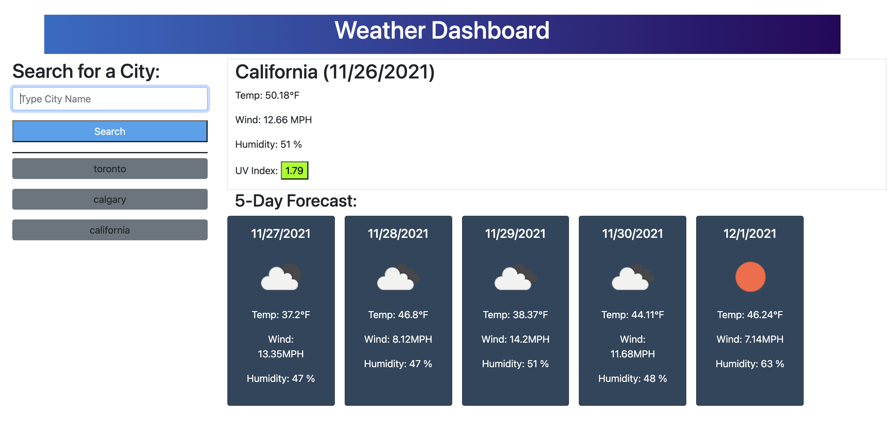

# Convenient Weather Board

## What is it?

A weather dashboard that runs in the browser and features dynamically updated HTML and CSS.

It uses the OpenWeather One Call API to retrieve weather data for cities and localStorage to store persistant data

## How does it work?

Write in any valid city or country name and either click on the search button or press enter and the weather forecast for that day will appear, more specifically, the temperature, wind speed, humidity and UV index will appear.

Right underneath the current weather will be the future weather forecast for the next 5 days

Each time you search a city, a button will appear under the search bar, this is your history and it will persist even after you refresh the page. You can click on any of the search history buttons and it will bring you the weather forecast for that city/country

One thing to keep in mind is that for the very first time you use this app, it will store up to 7 cities/countries before refreshing and disappearing and every other time after that it will store up to 8

## Link to Application

[Convenient Weather Dashboard](https://danielarzani.github.io/convenient-weather-dashboard/)

## Made With

HTML

Bootstrap

Javascript

A little bit of Moment.js

## Contributions

[One Weather Map API](https://openweathermap.org/)

Made by Daniel Arzanipour
